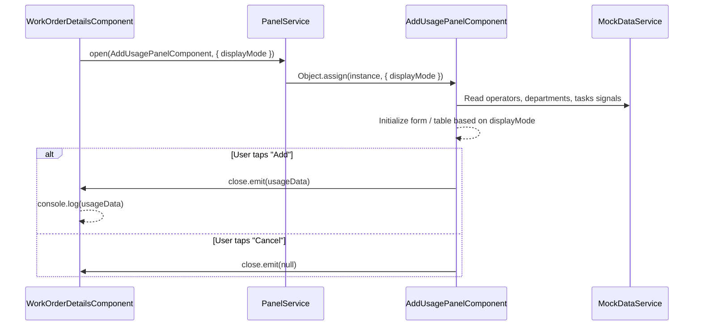

# Design Document — Add Usage Panel

## Overview

The Add Usage panel is a full-width slide-in overlay for recording equipment usage against a work order. It supports two entry modes — a single-entry form and a multi-entry table — toggled via a segmented control. A floating "Usage Display Mode" selector on the Work Order Details page controls which fields/columns are visible in the panel, allowing designers to demo different field configurations without code changes.

The panel follows the same PanelService lifecycle as the existing Employee Chooser panel: opened via `PanelService.open()`, closed via an `EventEmitter`-based `close` output, and result data is passed back through the `onClose` callback. All data is mock — no real API calls.

### Key Design Decisions

1. **PanelService pattern (not DrawerService)** — Matches the Employee Chooser reference implementation. PanelService uses CDK Overlay for full-width panels; DrawerService is for side drawers.
2. **Signals + OnPush** — All reactive state uses Angular signals and computed signals. `ChangeDetectionStrategy.OnPush` for performance.
3. **Reactive Forms** — `FormGroup` / `FormArray` for both single-entry and multi-entry modes. Enables validation and programmatic control.
4. **CCL-first** — Every UI element uses `@assetworks-llc/aw-component-lib` components. No custom HTML for patterns the library covers.
5. **Display mode as input property** — The `UsageDisplayMode` is set on the panel instance by PanelService via `Object.assign`, matching the Employee Chooser pattern (plain property, not signal input).

## Architecture

### Component Hierarchy

```
WorkOrderDetailsComponent (existing)
├── Floating Usage Display Mode selector (aw-select-menu)
└── PanelService.open(AddUsagePanelComponent, { displayMode })
    └── AddUsagePanelComponent
        ├── Header: "Add Usage" title (aw-divider)
        ├── Entry Mode Toggle (aw-chip segmented pattern)
        ├── Single Entry Form (conditional)
        │   └── Form fields (aw-form-field, aw-select-menu)
        ├── Multi Entry Table (conditional)
        │   └── aw-table with inline form controls
        └── Footer (aw-action-bar, sticky)
```

### Data Flow



### File Structure

```
src/app/features/add-usage/
├── add-usage-panel.component.ts       # Panel component (standalone, OnPush)
├── add-usage-panel.component.html     # Template
├── add-usage-panel.component.scss     # Panel-specific styles
└── usage-entry.interface.ts           # UsageEntry, UsageDisplayMode types
```

## Components and Interfaces

### AddUsagePanelComponent

Standalone component opened via PanelService. Manages both entry modes and emits usage data on close.

**Inputs (set by PanelService via Object.assign):**
- `displayMode: UsageDisplayMode` — Controls which fields/columns are visible.

**Outputs:**
- `close: OutputEmitterRef<UsageEntryResult | null>` — Emits usage data on "Add", null on "Cancel".

**Internal State (signals):**
- `entryMode: WritableSignal<'single' | 'multi'>` — Active entry mode, defaults to `'single'`.
- `singleEntryForm: FormGroup` — Reactive form for single-entry mode.
- `multiEntryRows: WritableSignal<FormGroup[]>` — Array of FormGroups for multi-entry rows.

**Computed Signals:**
- `visibleFields: Signal<UsageField[]>` — Derived from `displayMode`, determines which fields/columns to show.
- `operatorOptions: Signal<SingleSelectOption[]>` — From MockDataService operators.
- `departmentOptions: Signal<SingleSelectOption[]>` — From MockDataService departments.
- `taskOptions: Signal<SingleSelectOption[]>` — From MockDataService tasks.

**Key Methods:**
- `toggleEntryMode(mode: 'single' | 'multi'): void` — Switches between entry modes.
- `addRow(): void` — Appends a new empty FormGroup to `multiEntryRows`.
- `removeRow(index: number): void` — Removes a row from `multiEntryRows`.
- `onAdd(): void` — Collects form data and emits via `close`.
- `onCancel(): void` — Emits `close` with null.

### WorkOrderDetailsComponent (modifications)

**New State:**
- `usageDisplayMode: WritableSignal<string>` — Tracks the selected display mode, defaults to `'all'`.
- `displayModeOptions: SingleSelectOption[]` — The four display mode options.

**Modified Methods:**
- `onAddUsage(): void` — Opens the Add Usage panel via PanelService, passing `displayMode`.
- Update `moreActions` array to wire "Add Usage" to `onAddUsage()`.

### MockDataService (additions)

**New Signals:**
- `operators: Signal<MockOperator[]>` — Mock operator list (at least 3 entries).
- `departments: Signal<MockDepartment[]>` — Mock department list (at least 3 entries).

**Existing (reused):**
- `tasks` signal already provides `MockTask[]` with `taskId` and `taskDescription`.

## Data Models

### UsageDisplayMode

```typescript
/** Controls which fields are visible in the Add Usage panel. */
export type UsageDisplayMode = 'meter' | 'business' | 'both' | 'all';
```

| Mode Value | Label | Visible Fields |
|---|---|---|
| `'meter'` | Meter Values Only | Transaction Date, Hours Used, Operator |
| `'business'` | Business Usage Only | Transaction Date, Department, Task |
| `'both'` | Business Usage and Meter Values | Transaction Date, Hours Used, Operator, Department, Task |
| `'all'` | All Values (incl. Misc Codes) | All fields including any future misc code fields |

### UsageField

```typescript
/** Identifies a single field/column in the usage form/table. */
export type UsageField = 'transactionDate' | 'hoursUsed' | 'operator' | 'department' | 'task';
```

### Field Visibility Map

```typescript
/** Maps each display mode to its visible fields. */
export const DISPLAY_MODE_FIELDS: Record<UsageDisplayMode, UsageField[]> = {
  meter: ['transactionDate', 'hoursUsed', 'operator'],
  business: ['transactionDate', 'department', 'task'],
  both: ['transactionDate', 'hoursUsed', 'operator', 'department', 'task'],
  all: ['transactionDate', 'hoursUsed', 'operator', 'department', 'task'],
};
```

### UsageEntry

```typescript
/** A single usage record. */
export interface UsageEntry {
  transactionDate: string;   // ISO date string
  hoursUsed: number | null;
  operator: string | null;   // operator id
  department: string | null;  // department id
  task: string | null;        // task id
}
```

### UsageEntryResult

```typescript
/** Payload emitted when the panel closes with data. */
export interface UsageEntryResult {
  mode: 'single' | 'multi';
  entries: UsageEntry[];
}
```

### MockOperator / MockDepartment

```typescript
export interface MockOperator {
  id: string;
  name: string;
}

export interface MockDepartment {
  id: string;
  name: string;
}
```

### Display Mode Options (for WO Details selector)

```typescript
export const USAGE_DISPLAY_MODE_OPTIONS: SingleSelectOption[] = [
  { label: 'Meter Values Only', value: 'meter' },
  { label: 'Business Usage and Meter Values', value: 'both' },
  { label: 'Business Usage Only', value: 'business' },
  { label: 'All Values (incl. Misc Codes)', value: 'all' },
];
```


## Correctness Properties

*A property is a characteristic or behavior that should hold true across all valid executions of a system — essentially, a formal statement about what the system should do. Properties serve as the bridge between human-readable specifications and machine-verifiable correctness guarantees.*

### Property 1: Adding a row increases row count by exactly one

*For any* multi-entry table with N rows (where N ≥ 0), calling `addRow()` should result in exactly N + 1 rows.

**Validates: Requirements 4.3**

### Property 2: New rows default to today's date

*For any* sequence of `addRow()` calls, every newly created row's `transactionDate` form control value should equal today's date formatted as an ISO date string.

**Validates: Requirements 4.4**

### Property 3: Removing a row decreases count and removes the correct row

*For any* multi-entry table with N rows (where N > 0) and any valid index i (0 ≤ i < N), calling `removeRow(i)` should result in exactly N − 1 rows, and the row that was at index i should no longer be present in the remaining rows.

**Validates: Requirements 4.5**

### Property 4: Single-entry Add emits correct data

*For any* valid single-entry form state (with arbitrary transactionDate, hoursUsed, operator, department, and task values), calling `onAdd()` should emit a `UsageEntryResult` with `mode: 'single'` and exactly one entry whose field values match the form control values.

**Validates: Requirements 6.3**

### Property 5: Multi-entry Add emits all rows

*For any* set of K multi-entry rows (K ≥ 1) with arbitrary valid form values, calling `onAdd()` should emit a `UsageEntryResult` with `mode: 'multi'` and exactly K entries, where each entry's field values match the corresponding row's form control values.

**Validates: Requirements 6.4**

### Property 6: Display mode controls visible fields consistently

*For any* `UsageDisplayMode` value, the computed `visibleFields` should exactly equal `DISPLAY_MODE_FIELDS[mode]`. This mapping must be consistent whether applied to the single-entry form fields or the multi-entry table columns.

**Validates: Requirements 9.4, 9.5, 9.6, 9.7, 9.8, 9.9**

## Error Handling

This is a harness/prototype application with all mock data — there are no real API calls or external dependencies. Error handling is minimal:

1. **Invalid form state on Add** — The "Add" button should still emit whatever data is in the form. No validation blocking is required for the harness. Designers can see the form state as-is.
2. **Empty multi-entry table** — If the user deletes all rows and taps "Add", emit an empty entries array. The WO details page logs it to console.
3. **MockDataService fallback** — MockDataService already has hardcoded fallback data if JSON loading fails. No additional error handling needed for the panel.
4. **Display mode not set** — If `displayMode` is not provided (undefined), default to `'all'` to show all fields.

## Testing Strategy

### Unit Tests (Example-Based)

Unit tests cover specific behaviors, UI state checks, and integration points:

- **Panel lifecycle**: Verify PanelService.open is called with correct component and data; verify close output emits correct payloads.
- **Default states**: Entry mode defaults to 'single'; transaction date defaults to today; display mode defaults to 'all'.
- **Entry mode toggle**: Switching modes shows/hides the correct view.
- **MockDataService**: Operators and departments signals expose at least 3 entries with correct shape.
- **CCL component usage**: Verify the template uses aw-form-field, aw-select-menu, aw-table, aw-action-bar, aw-divider, aw-chip, aw-icon.
- **WO Details integration**: Floating selector renders with four options; "Add Usage" menu item opens the panel with current display mode.

### Property-Based Tests

Property-based tests verify universal properties across many generated inputs. Each test runs a minimum of 100 iterations using Jasmine loops with random data generation (per the project's testing guidelines — no external PBT libraries).

| Property | Test Description | Tag |
|---|---|---|
| Property 1 | Generate random row counts (0–50), call addRow(), verify count = N + 1 | Feature: add-usage-panel, Property 1: Adding a row increases row count by exactly one |
| Property 2 | Generate random sequences of addRow() calls (1–20), verify each new row has today's date | Feature: add-usage-panel, Property 2: New rows default to today's date |
| Property 3 | Generate random row counts (1–50) and random valid indices, call removeRow(), verify count = N − 1 and correct row removed | Feature: add-usage-panel, Property 3: Removing a row decreases count and removes the correct row |
| Property 4 | Generate random valid form values, call onAdd() in single mode, verify emitted result matches | Feature: add-usage-panel, Property 4: Single-entry Add emits correct data |
| Property 5 | Generate random row counts (1–20) with random form values, call onAdd() in multi mode, verify emitted result matches all rows | Feature: add-usage-panel, Property 5: Multi-entry Add emits all rows |
| Property 6 | For each of the 4 display modes, verify visibleFields matches DISPLAY_MODE_FIELDS mapping | Feature: add-usage-panel, Property 6: Display mode controls visible fields consistently |

### Test Configuration

- **Framework**: Jasmine + Karma (project standard)
- **Test setup**: Use `configureTestBed` helper to avoid Zone.js errors
- **Async tests**: Use `done()` callback pattern
- **Property iterations**: Minimum 100 per property test
- **No external PBT libraries**: Use Jasmine loops with `Math.random()` for input generation
