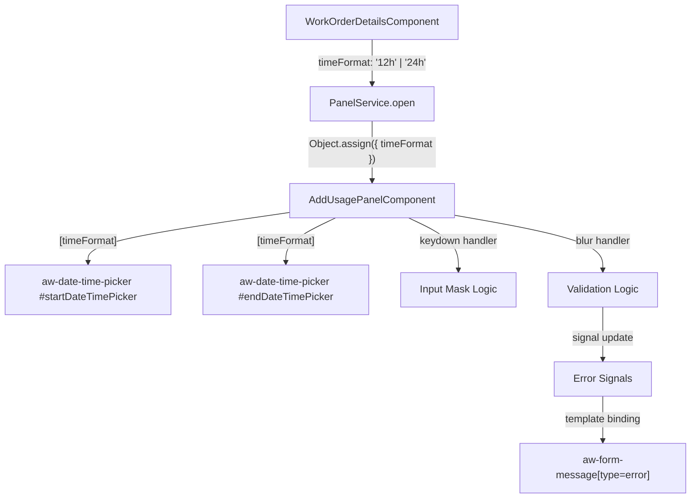

# Design Document: DateTime Picker Validation

## Overview

This design adds input masking, 12h/24h time format toggling, and blur-based validation to the `aw-date-time-picker` fields in the FE-528 harness Add Usage panel. The feature touches three layers:

1. **WorkOrderDetailsComponent** — adds a floating Time Format Toggle selector and passes the selected format through PanelService.
2. **AddUsagePanelComponent** — receives the time format, applies input masks via keydown handlers, validates on blur, and manages per-field error state with signals.
3. **Template (add-usage-panel.component.html)** — binds `[timeFormat]` to each `aw-date-time-picker`, attaches event handlers, and projects `aw-form-message[type=error]` for inline error display.

No new components are created. No API calls are involved (harness app with mock data).

## Architecture

### Data Flow



### Layer Responsibilities

| Layer | Responsibility |
|-------|---------------|
| `WorkOrderDetailsComponent` | Owns `timeFormat` property, renders Time Format Toggle, passes format to panel via PanelService |
| `PanelService` | Passes `{ timeFormat, displayMode }` via `Object.assign` to panel instance |
| `AddUsagePanelComponent` | Receives `timeFormat`, applies input masks (keydown), validates on blur, manages error signals |
| `aw-date-time-picker` (CCL) | Accepts `[timeFormat]` input, handles internal time display/parsing, projects error content child |

### Interaction with CCL Component

The `aw-date-time-picker` component has its own internal `parseDate()` and `parseTime()` methods that run on blur. Our validation runs **in addition to** the CCL's internal validation — we attach blur handlers to the date and time input elements within each picker to perform our own format and range checks. The CCL component's `errorMessage` signal and `messageComponent` content child handle the visual error state automatically when an `aw-form-message[type=error]` is projected.

Key CCL integration points:
- `[timeFormat]` input signal — accepts `'12h'` or `'24h'`, controls internal time display
- `aw-form-message[type=error]` content projection — CCL queries this via `@ContentChild` and applies error styling when present
- `dateInput` / `timeInput` ElementRef — internal references to the actual input elements (we access these via template ref + ViewChild for blur/keydown binding)

## Components and Interfaces

### WorkOrderDetailsComponent Modifications

**New property:**
```typescript
/** Current time format setting for date-time pickers. */
public timeFormat: '12h' | '24h' = '12h';
```

**New constant (in usage-entry.interface.ts):**
```typescript
/** Time format options for the floating selector. */
export const TIME_FORMAT_OPTIONS: SingleSelectOption[] = [
  { label: '12 Hour', value: '12h' },
  { label: '24 Hour', value: '24h' },
];
```

**Modified `onAddUsage()` method:**
```typescript
onAddUsage(): void {
  this._panelService.open(
    AddUsagePanelComponent,
    {
      displayMode: this.usageDisplayMode as UsageDisplayMode,
      timeFormat: this.timeFormat,
    },
    (result) => { if (result) console.log('Add Usage result:', result); }
  );
}
```

**Template addition** — a second floating selector below the existing Usage Display Mode selector:
```html
<div class="floating-display-mode">
  <!-- existing Usage Display Mode selector -->
  <aw-form-field-label>Usage Display Mode</aw-form-field-label>
  <aw-select-menu ...></aw-select-menu>

  <!-- new Time Format selector -->
  <div class="time-format-selector">
    <aw-form-field-label>Time Format</aw-form-field-label>
    <aw-select-menu
      [ariaLabel]="'Time Format'"
      [singleSelectListItems]="timeFormatOptions"
      [enableListReset]="false"
      [(ngModel)]="timeFormat"
    ></aw-select-menu>
  </div>
</div>
```

### AddUsagePanelComponent Modifications

**New properties:**
```typescript
/** Set by PanelService via Object.assign. Controls time format for date-time pickers. */
public timeFormat: '12h' | '24h' = '12h';

/** Validation error signals — one per validatable field. */
public readonly startDateError = signal<string | null>(null);
public readonly startTimeError = signal<string | null>(null);
public readonly endDateError = signal<string | null>(null);
public readonly endTimeError = signal<string | null>(null);
```

**New methods:**

```typescript
/** Restrict date input to digits and forward slash. */
onDateKeydown(event: KeyboardEvent): void;

/** Restrict time input based on active time format. */
onTimeKeydown(event: KeyboardEvent): void;

/** Validate date string on blur. Returns error message or null. */
validateDate(value: string): string | null;

/** Validate time string on blur based on format. Returns error message or null. */
validateTime(value: string, format: '12h' | '24h'): string | null;

/** Blur handler for start date input. */
onStartDateBlur(event: Event): void;

/** Blur handler for start time input. */
onStartTimeBlur(event: Event): void;

/** Blur handler for end date input. */
onEndDateBlur(event: Event): void;

/** Blur handler for end time input. */
onEndTimeBlur(event: Event): void;
```

**New import:**
```typescript
import { AwFormMessageComponent } from '@assetworks-llc/aw-component-lib';
```

### Template Modifications (add-usage-panel.component.html)

The `aw-date-time-picker` instances gain `[timeFormat]`, keydown handlers, blur handlers, and error message projection:

```html
<aw-date-time-picker #startDateTimePicker formControlName="startDateTime"
  [timeFormat]="timeFormat"
  [ariaLabel]="{date: 'Start Date', time: 'Start Time'}"
  [placeholder]="{date: 'mm/dd/yyyy', time: timeFormat === '12h' ? 'hh:mm AM/PM' : 'hh:mm'}">
  <aw-form-field-label>Start Date / Time</aw-form-field-label>
  <button aria-label="open start date time picker" type="button"
    AwButtonIconOnly [buttonType]="'primary'"
    (click)="startDateTimePicker.openDateTimePicker()">
    <aw-icon [iconName]="'today'" [iconColor]="''"></aw-icon>
  </button>
  @if (startDateError() || startTimeError()) {
    <aw-form-message [type]="'error'">
      {{ startDateError() || startTimeError() }}
    </aw-form-message>
  }
</aw-date-time-picker>
```

The same pattern applies to the End Date/Time picker with `endDateError` / `endTimeError`.

## Data Models

### Validation State Model

Each `aw-date-time-picker` instance has two validatable sub-fields (date and time), each tracked by an independent signal:

```typescript
/** Per-field validation error state. Null means no error. */
interface ValidationState {
  startDateError: WritableSignal<string | null>;
  startTimeError: WritableSignal<string | null>;
  endDateError: WritableSignal<string | null>;
  endTimeError: WritableSignal<string | null>;
}
```

These are plain `signal<string | null>(null)` properties on `AddUsagePanelComponent` — not a separate interface file, since they're component-internal state.

### Time Format Type

The time format is a simple union type, already compatible with the CCL's `timeFormat` input:

```typescript
type TimeFormat = '12h' | '24h';
```

This is used as a plain property type on both `WorkOrderDetailsComponent` and `AddUsagePanelComponent`.

### Input Mask Allowed Characters

| Mode | Field | Allowed Characters |
|------|-------|--------------------|
| Any | Date | `0-9`, `/` |
| 24h | Time | `0-9`, `:` |
| 12h | Time | `0-9`, `:`, `A`, `M`, `P`, `a`, `m`, `p`, ` ` (space) |

Navigation keys (`Backspace`, `Tab`, `ArrowLeft`, `ArrowRight`, `Delete`, `Home`, `End`) are always allowed regardless of mode.

### Validation Rules

**Date validation (MM/DD/YYYY):**
1. Empty string → no error (field is optional)
2. Does not match `/^\d{2}\/\d{2}\/\d{4}$/` → `"Invalid date format. Use MM/DD/YYYY"`
3. Matches format but invalid calendar date (month not 1-12, day exceeds month max, etc.) → `"Invalid date"`
4. Valid date → no error

**Time validation (12h — `H:MM AM/PM` or `HH:MM AM/PM`):**
1. Empty string → no error
2. Does not match `/^(0?[1-9]|1[0-2]):[0-5]\d\s?(AM|PM|am|pm)$/` → `"Invalid time. Use HH:MM AM/PM (1-12)"`
3. Valid → no error

**Time validation (24h — `H:MM` or `HH:MM`):**
1. Empty string → no error
2. Does not match `/^([01]?\d|2[0-3]):[0-5]\d$/` → `"Invalid time. Use HH:MM (0-23)"`
3. Valid → no error

## Correctness Properties

*A property is a characteristic or behavior that should hold true across all valid executions of a system — essentially, a formal statement about what the system should do. Properties serve as the bridge between human-readable specifications and machine-verifiable correctness guarantees.*

### Property 1: Date mask allows only digits and slash

*For any* printable character, the date input mask function SHALL allow the character if and only if it is a digit (`0-9`) or a forward slash (`/`). All other non-navigation characters SHALL be blocked.

**Validates: Requirements 1.1, 1.2**

### Property 2: Time mask in 24h mode allows only digits and colon

*For any* printable character, when the time format is `'24h'`, the time input mask function SHALL allow the character if and only if it is a digit (`0-9`) or a colon (`:`). All other non-navigation characters SHALL be blocked.

**Validates: Requirements 2.1, 2.3**

### Property 3: Time mask in 12h mode allows digits, colon, AM/PM letters, and space

*For any* printable character, when the time format is `'12h'`, the time input mask function SHALL allow the character if and only if it is a digit (`0-9`), a colon (`:`), one of the letters `A`, `M`, `P` (case-insensitive), or a space. All other non-navigation characters SHALL be blocked.

**Validates: Requirements 2.2, 2.3**

### Property 4: Date validation classifies all non-empty strings correctly

*For any* non-empty string, the `validateDate` function SHALL return `"Invalid date format. Use MM/DD/YYYY"` if the string does not match the `MM/DD/YYYY` pattern, `"Invalid date"` if it matches the pattern but is not a valid calendar date, and `null` if it is a valid calendar date.

**Validates: Requirements 4.2, 4.3, 4.5**

### Property 5: 12h time validation classifies all non-empty strings correctly

*For any* non-empty string, the `validateTime` function in `'12h'` mode SHALL return `"Invalid time. Use HH:MM AM/PM (1-12)"` if the string is not a valid 12-hour time (hours 1-12, minutes 00-59, followed by AM or PM), and `null` if it is valid.

**Validates: Requirements 5.2, 5.5**

### Property 6: 24h time validation classifies all non-empty strings correctly

*For any* non-empty string, the `validateTime` function in `'24h'` mode SHALL return `"Invalid time. Use HH:MM (0-23)"` if the string is not a valid 24-hour time (hours 0-23, minutes 00-59), and `null` if it is valid.

**Validates: Requirements 5.3, 5.5**

### Property 7: Valid input clears error state on blur

*For any* field that currently has a validation error, if the user enters a valid value and triggers a blur event, the error signal for that field SHALL become `null`.

**Validates: Requirements 6.2, 6.3**

### Property 8: Validation errors are independent across fields

*For any* pair of distinct validatable fields (startDate, startTime, endDate, endTime), setting a validation error on one field SHALL not change the error state of any other field.

**Validates: Requirements 7.1, 7.2**

## Error Handling

### Input Mask Errors

Input masks operate at the keydown level and silently prevent invalid characters. No error messages are shown for blocked keystrokes — the character simply does not appear. This is standard input mask behavior.

### Validation Errors

Validation errors are displayed inline below the affected field using `aw-form-message[type=error]` projected into the `aw-date-time-picker`'s error content slot. The CCL component automatically applies error styling (red border, error icon) when this content child is present.

Error messages are specific and actionable:
- `"Invalid date format. Use MM/DD/YYYY"` — tells the user the expected format
- `"Invalid date"` — format is correct but the date doesn't exist
- `"Invalid time. Use HH:MM AM/PM (1-12)"` — 12h format guidance
- `"Invalid time. Use HH:MM (0-23)"` — 24h format guidance

### Edge Cases

| Scenario | Behavior |
|----------|----------|
| Empty field on blur | No error (fields are optional) |
| Partial input (e.g., `12/`) | Format error on blur |
| Leading zeros (e.g., `01/01/2024`) | Valid — accepted |
| Leap year dates (e.g., `02/29/2024`) | Valid — accepted (2024 is a leap year) |
| Non-leap year Feb 29 (e.g., `02/29/2023`) | Invalid date error |
| Time with no space before AM/PM (e.g., `12:00PM`) | Valid — regex allows optional space |
| Lowercase am/pm | Valid — case-insensitive matching |

## Testing Strategy

### Property-Based Tests

Property-based testing is appropriate for this feature because the input masking and validation functions are pure functions with clear input/output behavior and a large input space (all printable characters, all possible date/time strings).

**Library:** Jasmine loops (100 iterations with random data), per the project's testing guidelines. No external PBT libraries.

**Configuration:**
- Minimum 100 iterations per property test
- Each test references its design document property number
- Tag format: `Feature: datetime-picker-validation, Property N: [description]`

**Properties to test:**
1. Date mask character filtering (Property 1)
2. Time mask 24h character filtering (Property 2)
3. Time mask 12h character filtering (Property 3)
4. Date validation correctness (Property 4)
5. 12h time validation correctness (Property 5)
6. 24h time validation correctness (Property 6)
7. Error clearing on valid input (Property 7)
8. Validation state independence (Property 8)

### Unit Tests (Example-Based)

| Test | Type | Validates |
|------|------|-----------|
| Navigation keys pass through date mask | Example | Req 1.3 |
| Navigation keys pass through time mask | Example | Req 2.4 |
| Time Format Toggle renders with correct options | Example | Req 3.1, 3.2 |
| Time format defaults to '12h' | Example | Req 3.3 |
| Selecting format updates property | Example | Req 3.4 |
| Empty date produces no error | Edge case | Req 4.4 |
| Empty time produces no error | Edge case | Req 5.4 |
| All error signals are null on init | Example | Req 7.4 |

### Integration Tests

| Test | Validates |
|------|-----------|
| Both date-time pickers receive timeFormat binding | Req 3.6 |
| PanelService.open called with timeFormat | Req 3.5 |
| Blur handlers attached to date/time inputs | Req 4.1, 5.1 |
| Error messages projected via aw-form-message | Req 4.6, 5.6 |
