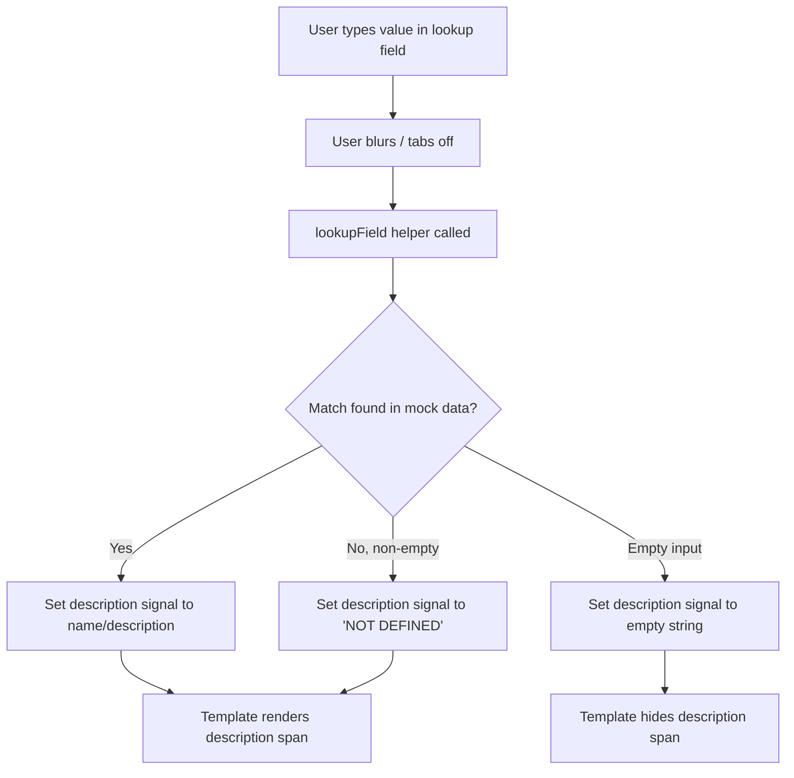
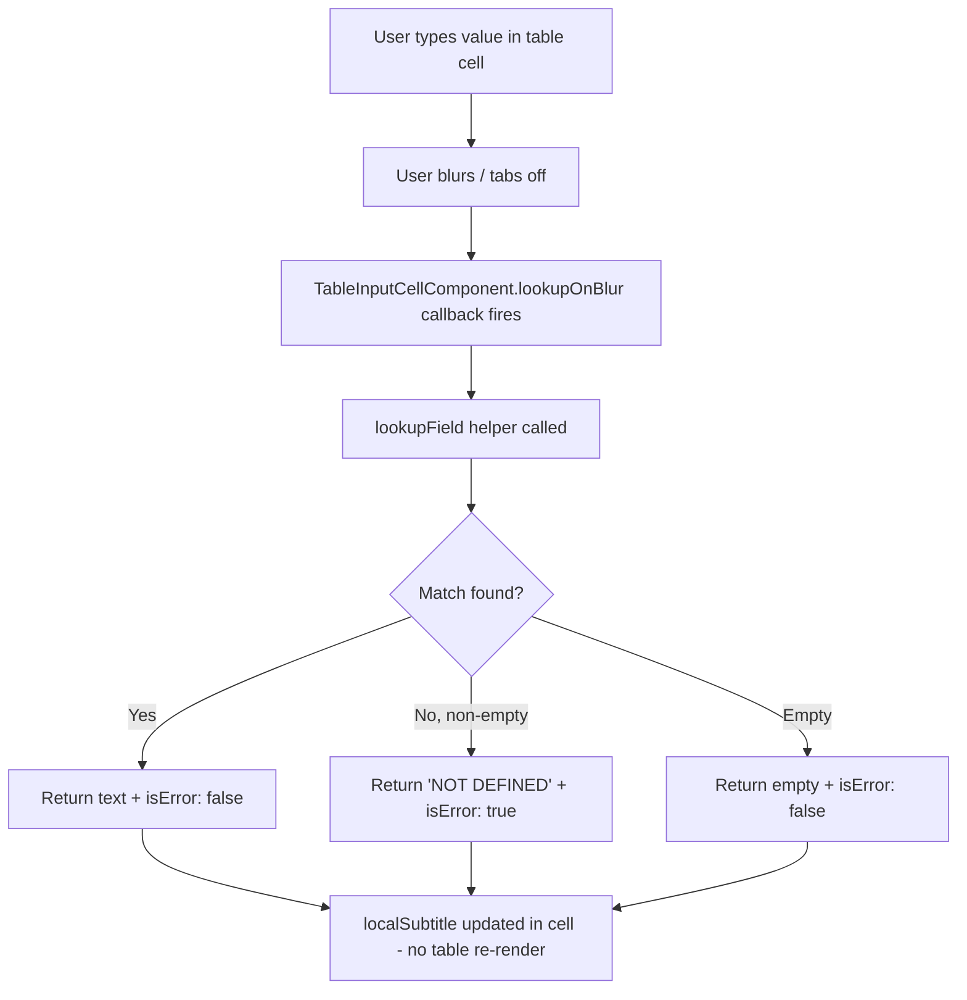

# Design Document: Lookup Field Descriptions

## Overview

This feature adds description text below all six lookup fields (Asset, Account, Operator, Department, Task, Financial Project Code) in the Add Usage panel. When a user types a value and tabs off (blur), the field resolves the value against mock data and displays either the matching description or "NOT DEFINED" below the input. This applies to both single-entry form and multi-entry table modes.

The Asset field in multi-entry mode already implements this pattern via `TableAssetCellComponent`. This design extends the same behavior to the remaining five lookup fields in multi-entry (by wiring `lookupOnBlur` into `TableInputCellComponent`) and adds description support to all six fields in single-entry mode (which currently has no description spans).

### Design Decisions

1. **No new components** — Single-entry descriptions use a `<span>` added directly to the template. Multi-entry descriptions use the existing `lookupOnBlur` and `localSubtitle` support already built into `TableInputCellComponent`.

2. **Shared lookup helper** — A single `lookupField()` helper method on the component handles all six field types, taking the field name and typed value as parameters. This avoids duplicating lookup logic across fields.

3. **Signals for single-entry descriptions** — Each single-entry lookup field gets a pair of signals (`signal<string>` for text, `signal<boolean>` for error state) that update on blur. This keeps the template reactive without triggering unnecessary change detection.

4. **Mock task data for lookup** — The task search dialog has its own internal mock data (repair groups, children, sub-children). For the blur-based lookup, we need a flat list of all task IDs → descriptions. We'll build this as a computed signal from the existing task dialog data, or define a simple lookup map in the component.

## Architecture

### Component Modification Strategy

All changes are confined to three files:

```
add-usage-panel.component.ts   — Add lookup helper, description signals, blur handlers
add-usage-panel.component.html — Add description <span> elements below each lookup field
add-usage-panel.component.scss — Add .field-desc style (already has .field-subtitle)
```

Plus documentation updates:
```
MOCK-DATA-GUIDE.md — Document lookup field data sources and scenarios
README.md          — Document lookup field description behavior
```

### Data Flow



### Multi-Entry Data Flow



## Components and Interfaces

### Modified: `AddUsagePanelComponent`

#### New Signals (Single-Entry Descriptions)

```typescript
// Asset description (single-entry)
public readonly singleAssetDesc = signal<string>('');
public readonly singleAssetDescError = signal<boolean>(false);

// Account description
public readonly singleAccountDesc = signal<string>('');
public readonly singleAccountDescError = signal<boolean>(false);

// Operator description
public readonly singleOperatorDesc = signal<string>('');
public readonly singleOperatorDescError = signal<boolean>(false);

// Department description
public readonly singleDepartmentDesc = signal<string>('');
public readonly singleDepartmentDescError = signal<boolean>(false);

// Task description
public readonly singleTaskDesc = signal<string>('');
public readonly singleTaskDescError = signal<boolean>(false);

// Financial Project Code description
public readonly singleFpcDesc = signal<string>('');
public readonly singleFpcDescError = signal<boolean>(false);
```

#### New Method: `lookupField()`

A single helper that resolves any lookup field value against its mock data source:

```typescript
/**
 * Resolve a lookup field value against mock data.
 * Returns { text: description, isError: boolean }.
 * - Match found → { text: name/description, isError: false }
 * - No match, non-empty → { text: 'NOT DEFINED', isError: true }
 * - Empty input → { text: '', isError: false }
 */
public lookupField(fieldName: string, value: string): { text: string; isError: boolean } {
  const trimmed = (value ?? '').trim();
  if (!trimmed) return { text: '', isError: false };

  switch (fieldName) {
    case 'asset': {
      const match = this.assetSearchOptions().find(
        a => a.value.toLowerCase() === trimmed.toLowerCase()
      );
      return match
        ? { text: match.description, isError: false }
        : { text: 'NOT DEFINED', isError: true };
    }
    case 'account': {
      const match = this._mockData.accounts().find(
        a => a.id.toLowerCase() === trimmed.toLowerCase()
      );
      return match
        ? { text: match.name, isError: false }
        : { text: 'NOT DEFINED', isError: true };
    }
    case 'operator': {
      const match = this._mockData.operators().find(
        o => o.id.toLowerCase() === trimmed.toLowerCase()
      );
      return match
        ? { text: match.name, isError: false }
        : { text: 'NOT DEFINED', isError: true };
    }
    case 'department': {
      const match = this._mockData.departments().find(
        d => d.id.toLowerCase() === trimmed.toLowerCase()
      );
      return match
        ? { text: match.name, isError: false }
        : { text: 'NOT DEFINED', isError: true };
    }
    case 'task': {
      const match = this._taskLookupMap().find(
        t => t.id.toLowerCase() === trimmed.toLowerCase()
      );
      return match
        ? { text: match.name, isError: false }
        : { text: 'NOT DEFINED', isError: true };
    }
    case 'financialProjectCode': {
      const match = this._mockData.financialProjectCodes().find(
        f => f.id.toLowerCase() === trimmed.toLowerCase()
      );
      return match
        ? { text: match.name, isError: false }
        : { text: 'NOT DEFINED', isError: true };
    }
    default:
      return { text: '', isError: false };
  }
}
```

#### New Computed: `_taskLookupMap`

A flat map of all task IDs to descriptions for blur-based lookup. Built from the same data the task search dialog uses:

```typescript
private readonly _taskLookupMap = computed<{ id: string; name: string }[]>(() => [
  { id: 'TSK-101', name: 'Oil Change' },
  { id: 'TSK-102', name: 'Brake Pad Replacement' },
  { id: 'TSK-103', name: 'Tire Rotation' },
  { id: 'TSK-104', name: 'Air Filter Replacement' },
  { id: 'TSK-105', name: 'Coolant Flush' },
  { id: 'TSK-106', name: 'Transmission Service' },
  { id: 'TSK-107', name: 'Battery Replacement' },
  { id: 'TSK-108', name: 'Spark Plug Replacement' },
  { id: 'TSK-109', name: 'Alignment Service' },
  { id: 'TSK-110', name: 'Oil Filter Replacement' },
  { id: 'TSK-111', name: 'Oil Pan Gasket' },
  { id: 'TSK-112', name: 'Oil Pump Service' },
  { id: 'TSK-113', name: 'Front Brake Rotor' },
  { id: 'TSK-114', name: 'Front Caliper Service' },
]);
```

#### New Blur Handlers (Single-Entry)

Each lookup field gets a blur handler that calls `lookupField()` and updates the corresponding signals:

```typescript
public onSingleFieldBlur(fieldName: string): void {
  const value = this.singleEntryForm.get(fieldName)?.value ?? '';
  const result = this.lookupField(fieldName, value);
  // Update the appropriate signal pair based on fieldName
  // e.g., for 'account': this.singleAccountDesc.set(result.text);
  //                       this.singleAccountDescError.set(result.isError);
}
```

#### Modified: `buildColumnDef()` — Multi-Entry Lookup Columns

The five lookup field column definitions (account, operator, department, task, financialProjectCode) are updated to pass `lookupOnBlur` callbacks to `TableInputCellComponent`:

```typescript
case 'account':
  return {
    // ... existing config ...
    componentData: {
      // ... existing props ...
      lookupOnBlur: (value: string) => this.lookupField('account', value),
    },
  };
```

This is the only change needed for multi-entry — `TableInputCellComponent` already handles `lookupOnBlur`, `localSubtitle`, and `localSubtitleError` display internally.

#### Modified: `onAssetSearchClose()` — Single-Entry Asset Description

After setting the asset value from dialog selection, also update the single-entry asset description signals:

```typescript
if (!isMulti) {
  this.singleAssetDesc.set(result.selectedAsset.EquipmentDescription);
  this.singleAssetDescError.set(false);
}
```

#### Modified: `onTaskSearchClose()` — Single-Entry Task Description

After setting the task value from dialog selection, also update the single-entry task description signals:

```typescript
if (!isMulti) {
  const taskResult = this.lookupField('task', result.taskId);
  this.singleTaskDesc.set(taskResult.text);
  this.singleTaskDescError.set(taskResult.isError);
}
```

### Modified: `add-usage-panel.component.html`

Each single-entry lookup field gets a description `<span>` added below the `field-with-icon` div, inside the `.form-field` div:

```html
<!-- Example: Account field -->
<div class="form-field">
  <aw-form-field-label>Account</aw-form-field-label>
  <div class="field-with-icon">
    <aw-form-field>
      <input AwInput formControlName="account" aria-label="Account"
        (blur)="onSingleFieldBlur('account')" />
    </aw-form-field>
    <button AwButtonIconOnly ...>...</button>
  </div>
  @if (singleAccountDesc()) {
    <span class="aw-c-1 field-desc">{{ singleAccountDesc() }}</span>
  }
</div>
```

### Modified: `add-usage-panel.component.scss`

Add the `.field-desc` class for single-entry description text:

```scss
.field-desc {
  display: block;
  color: var(--system-text-text-secondary, #5b6670);
  margin-left: 2px;
}
```

### Existing: `TableInputCellComponent` (No Changes Needed)

This component already supports:
- `lookupOnBlur` input — callback `(value: string) => { text: string; isError: boolean }`
- `localSubtitle` / `localSubtitleError` — local state updated on blur without table re-render
- Hidden spacer when no subtitle — maintains consistent row height

No modifications needed. We just need to pass `lookupOnBlur` in the `buildColumnDef()` `componentData`.

### Existing: `TableAssetCellComponent` (No Changes Needed)

Already implements the full description pattern for the Asset column in multi-entry mode. No changes needed.

## Data Models

### No New Data Models

All data structures already exist:
- `MockAccount` — `{ id: string; name: string }` in `usage-entry.interface.ts`
- `MockOperator` — `{ id: string; name: string }` in `usage-entry.interface.ts`
- `MockDepartment` — `{ id: string; name: string }` in `usage-entry.interface.ts`
- `MockFinancialProjectCode` — `{ id: string; name: string }` in `usage-entry.interface.ts`
- Asset search options — `{ label: string; value: string; description: string }[]` in component
- Task lookup map — `{ id: string; name: string }[]` defined as new computed in component

### Mock Data Sources for Lookup

| Field | Data Source | Match Key | Display Value |
|-------|-----------|-----------|---------------|
| Asset | `assetSearchOptions()` (component) | `value` (equipment ID) | `description` |
| Account | `MockDataService.accounts()` | `id` | `name` |
| Operator | `MockDataService.operators()` | `id` | `name` |
| Department | `MockDataService.departments()` | `id` | `name` |
| Task | `_taskLookupMap` (component computed) | `id` | `name` |
| Financial Project Code | `MockDataService.financialProjectCodes()` | `id` | `name` |

## Correctness Properties

*A property is a characteristic or behavior that should hold true across all valid executions of a system — essentially, a formal statement about what the system should do. Properties serve as the bridge between human-readable specifications and machine-verifiable correctness guarantees.*

### Property 1: Lookup returns correct description for valid IDs

*For any* lookup field type (asset, account, operator, department, task, financialProjectCode) and *for any* valid ID that exists in that field's mock data source, calling `lookupField(fieldType, validId)` SHALL return `{ text: <the corresponding name/description>, isError: false }`.

**Validates: Requirements 1.1, 2.1, 3.1, 4.1, 5.1, 6.1, 7.1, 8.1, 9.1, 10.1, 11.1**

### Property 2: Lookup is case-insensitive

*For any* lookup field type and *for any* valid ID in that field's mock data source, calling `lookupField(fieldType, id)` SHALL return the same description regardless of the casing of the input (uppercase, lowercase, mixed case).

**Validates: Requirements 1.1, 2.1, 3.1, 4.1, 5.1, 6.1, 7.1, 8.1, 9.1, 10.1, 11.1**

### Property 3: Lookup returns "NOT DEFINED" for invalid non-empty inputs

*For any* lookup field type and *for any* non-empty string that does NOT match any ID in that field's mock data source, calling `lookupField(fieldType, invalidValue)` SHALL return `{ text: 'NOT DEFINED', isError: true }`.

**Validates: Requirements 1.3, 2.3, 3.3, 4.3, 5.3, 6.3, 7.3, 8.3, 9.3, 10.3, 11.3**

### Property 4: Lookup returns empty for empty/whitespace input

*For any* lookup field type and *for any* string composed entirely of whitespace (including the empty string), calling `lookupField(fieldType, whitespaceString)` SHALL return `{ text: '', isError: false }`.

**Validates: Requirements 1.4, 1.5, 2.4, 2.5, 3.4, 3.5, 4.4, 4.5, 5.4, 5.5, 6.4, 6.5, 7.4, 8.4, 9.4, 10.4, 11.4**

## Error Handling

### Lookup Failures

The lookup function is a pure in-memory operation against mock data — no network calls, no async operations. Errors are not expected. If the mock data signal is somehow empty, the lookup will simply return "NOT DEFINED" for any input, which is the correct degraded behavior.

### Edge Cases

| Scenario | Behavior |
|----------|----------|
| Field value is `null` or `undefined` | Treated as empty — description hidden |
| Field value is whitespace only | Treated as empty — description hidden |
| Mock data array is empty | All lookups return "NOT DEFINED" |
| Asset selected via dialog then manually edited | Blur handler re-evaluates the new value |
| Task field contains `(TSK-101) Oil Change` format | Lookup matches on the raw form value; if the user types the full formatted string, it won't match the ID alone — this is expected since the format is set by dialog selection, not manual typing |

## Testing Strategy

### Checkpoint 1: Single-Entry Descriptions

Manual testing scenarios:
1. Type `ACC-001` in Account field, tab off → "General Maintenance" appears below
2. Type `INVALID` in Account field, tab off → "NOT DEFINED" appears below
3. Clear Account field, tab off → description disappears
4. Repeat for all six lookup fields
5. Select asset via dialog → description appears
6. Select task via dialog → description appears

### Checkpoint 2: Multi-Entry Descriptions

Manual testing scenarios:
1. In multi-entry mode, type `OP-001` in Operator cell, tab off → "John Miller" appears below
2. Type `INVALID` in Operator cell, tab off → "NOT DEFINED" appears below
3. Clear Operator cell, tab off → spacer shown (no visible text)
4. Repeat for Account, Department, Task, Financial Project Code cells
5. Verify Asset column still works (already implemented)
6. Verify row heights are consistent across all cells

### Property-Based Testing

This feature is suitable for property-based testing because the core `lookupField()` function is a pure function with clear input/output behavior and a meaningful input space (field types × string values).

**Library:** Jasmine loops (100 iterations per property) — per project testing guidelines.

**Configuration:**
- Minimum 100 iterations per property test
- Each test references its design document property
- Tag format: `Feature: lookup-field-descriptions, Property N: <property text>`

**Test approach:**
- Generate random field types from the set of 6 lookup fields
- Generate random strings (mix of valid IDs from mock data and random gibberish)
- Generate random case variations of valid IDs
- Generate random whitespace strings
- Verify the `lookupField()` return value matches the expected property

### Unit Tests (Example-Based)

- Verify description `<span>` appears with correct CSS classes (`aw-c-1`, `field-desc`)
- Verify description `<span>` uses `text-secondary` color
- Verify dialog selection updates description signals
- Verify multi-entry `lookupOnBlur` is wired in column definitions
