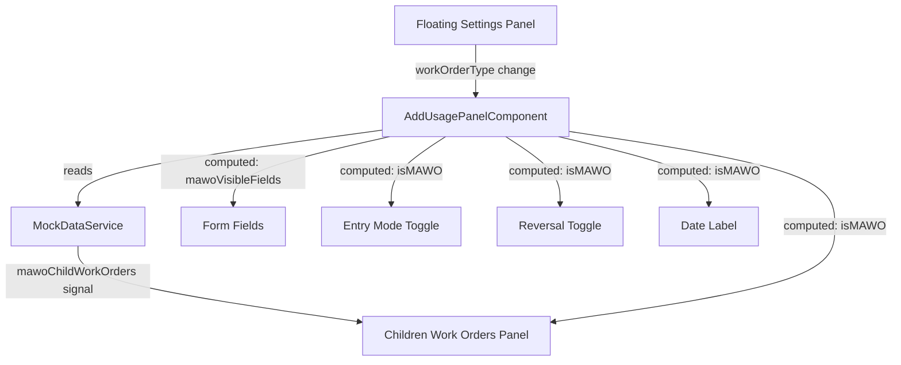

# Design Document: MAWO Add Usage

## Overview

This design adds Multi-Asset Work Order (MAWO) support to the existing Add Usage panel in the FE-528 harness. The implementation introduces a mode toggle (`standard` / `mawo`) on the floating settings panel, conditional field visibility based on the active mode, a Reversal toggle, a relabeled date field, and a Children Work Orders expansion panel with search, status filter, and selectable table.

All changes are scoped to existing files — no new Angular components are created except a `TableTextSubtextComponent` (which does not exist in FE-528 but is needed for text/subtext table cells). The existing Standard mode remains completely unchanged.

### Key Design Decisions

1. **Mode as a component property, not a route or service state.** The `workOrderType` property lives on `AddUsagePanelComponent` and is controlled by the floating settings panel, matching the existing `displayMode` and `timeFormat` pattern. This keeps the toggle local to the panel and avoids unnecessary service coupling.

2. **Reuse `visibleFields` pattern for MAWO field hiding.** Rather than adding separate `@if` blocks for MAWO mode, the existing `DISPLAY_MODE_FIELDS` mechanism is extended so MAWO mode can suppress fields declaratively. However, since MAWO hides fields *across all display modes*, a separate computed signal (`mawoVisibleFields`) filters out MAWO-hidden fields from the base `visibleFields` result.

3. **Children Work Orders data lives in MockDataService.** Follows the established pattern where all mock data is centralized in `MockDataService` with signal-based access.

4. **TableTextSubtextComponent is created in FE-528.** FE-3999 has this component but FE-528 does not. A minimal copy is created at `src/app/components/table-text-subtext/` following the exact same implementation.

## Architecture

### Component Interaction



### Data Flow

1. User selects "MAWO" from the Work Order Type selector in the floating settings panel.
2. `onWorkOrderTypeChange()` extracts `.value` from the emitted object (same pattern as `onTimeFormatChange`).
3. `workOrderType` signal updates → `isMAWO` computed signal recalculates.
4. `mawoVisibleFields` computed signal filters out MAWO-hidden fields from the base `visibleFields`.
5. Template `@if` blocks use `isMAWO()` for MAWO-only elements (Reversal toggle, Children Work Orders panel).
6. Children Work Orders table reads from `MockDataService.mawoChildWorkOrders()` signal.
7. Local signals for search text and status filter drive a `filteredChildWorkOrders` computed signal.

### Files Modified

| File | Changes |
|------|---------|
| `usage-entry.interface.ts` | Add `WorkOrderType`, `WORK_ORDER_TYPE_OPTIONS`, `MockMAWOChildWorkOrder`, `MockMAWOParent`, `MAWO_HIDDEN_FIELDS` |
| `add-usage-panel.component.ts` | Add `workOrderType` signal, `isMAWO` computed, `mawoVisibleFields` computed, reversal form control, children WO filtering logic, `onWorkOrderTypeChange()`, children WO table columns/data |
| `add-usage-panel.component.html` | Add WO type selector to floating panel, conditional entry mode toggle, date label switch, reversal toggle, Children Work Orders expansion panel |
| `add-usage-panel.component.scss` | Add `.sr-search-row`, `.sr-search-input`, `.sr-table-container`, `.reversal-toggle` styles |
| `mock-data.service.ts` | Add `MockMAWOChildWorkOrder` interface import, `mawoParent` signal, `mawoChildWorkOrders` signal with 6 child work orders |
| `MOCK-DATA-GUIDE.md` | Add MAWO section documenting parent WO, child WOs, and quick scenarios |
| `src/app/components/table-text-subtext/table-text-subtext.component.ts` | New file — minimal text/subtext cell component |

## Components and Interfaces

### New Types (`usage-entry.interface.ts`)

```typescript
/** Controls whether the Add Usage panel operates in Standard or MAWO mode. */
export type WorkOrderType = 'standard' | 'mawo';

/** Work order type options for the floating settings panel selector. */
export const WORK_ORDER_TYPE_OPTIONS: SingleSelectOption[] = [
  { label: 'Standard', value: 'standard' },
  { label: 'MAWO', value: 'mawo' },
];

/** Fields hidden when in MAWO mode, regardless of display mode. */
export const MAWO_HIDDEN_FIELDS: UsageField[] = [
  'startDateTime',
  'endDateTime',
  'operator',
  'department',
  'task',
  'financialProjectCode',
];

/** A child work order belonging to a MAWO parent. */
export interface MockMAWOChildWorkOrder {
  workOrderId: string;
  title: string;
  assetId: string;
  assetDescription: string;
  status: 'Open' | 'Work Finished';
  selected: boolean;
}

/** MAWO parent work order with its children. */
export interface MockMAWOParent {
  parentWorkOrderId: string;
  parentTitle: string;
  children: MockMAWOChildWorkOrder[];
}
```

### New Signals on `AddUsagePanelComponent`

```typescript
/** Current work order type — Standard or MAWO. */
public readonly workOrderType = signal<WorkOrderType>('standard');

/** Whether the panel is in MAWO mode. */
public readonly isMAWO = computed(() => this.workOrderType() === 'mawo');

/** Visible fields adjusted for MAWO mode — filters out MAWO-hidden fields. */
public readonly mawoVisibleFields = computed(() => {
  const base = this.visibleFields();
  if (!this.isMAWO()) return base;
  return base.filter(f => !MAWO_HIDDEN_FIELDS.includes(f));
});

/** Work order type options for the floating selector. */
public readonly workOrderTypeOptions = WORK_ORDER_TYPE_OPTIONS;

/** Search text for children work orders table. */
public readonly childWOSearchText = signal<string>('');

/** Status filter for children work orders table. */
public readonly childWOStatusFilter = signal<string>('All');

/** Filtered children work orders based on search and status filter. */
public readonly filteredChildWorkOrders = computed(() => {
  let children = this._mockData.mawoChildWorkOrders();
  const status = this.childWOStatusFilter();
  const search = this.childWOSearchText().toLowerCase().trim();

  if (status !== 'All') {
    children = children.filter(c => c.status === status);
  }
  if (search) {
    children = children.filter(c =>
      c.assetId.toLowerCase().includes(search) ||
      c.assetDescription.toLowerCase().includes(search) ||
      c.workOrderId.toLowerCase().includes(search) ||
      c.title.toLowerCase().includes(search)
    );
  }
  return children;
});
```

### Children Work Orders Table Columns

```typescript
/** Status filter options for children work orders. */
public readonly childWOStatusOptions: SingleSelectOption[] = [
  { label: 'All', value: 'All' },
  { label: 'Open', value: 'Open' },
  { label: 'Work Finished', value: 'Work Finished' },
];

/** Column definitions for the children work orders table. */
public readonly childWOColumns: TableCellInput[] = [
  { type: TableCellTypes.Checkbox, key: 'selected', label: '' },
  {
    sort: true, align: 'left', type: TableCellTypes.Custom, key: 'assetId', label: 'Asset',
    combineFields: ['assetId', 'assetDescription'],
    combineTemplate: (values: any[]) => ({
      component: TableTextSubtextComponent,
      componentData: { text: values[0], subText: values[1] }
    })
  },
  {
    sort: true, align: 'left', type: TableCellTypes.Custom, key: 'workOrderId', label: 'Work Order',
    combineFields: ['workOrderId', 'title'],
    combineTemplate: (values: any[]) => ({
      component: TableTextSubtextComponent,
      componentData: { text: values[0], subText: values[1] }
    })
  },
  { sort: true, align: 'left', type: TableCellTypes.Title, key: 'status', label: 'Status' },
];
```

### TableTextSubtextComponent (New File)

```typescript
@Component({
  selector: 'app-table-text-subtext',
  standalone: true,
  template: `
    <span class="title">{{ text() }}</span>
    <span class="sub-title">{{ subText() }}</span>
  `,
  styles: [`
    :host {
      display: flex;
      flex-direction: column;
    }
  `]
})
export class TableTextSubtextComponent {
  text = input<string>('');
  subText = input<string>('');
}
```

### Template Changes (Key Sections)

**Floating Settings Panel — Work Order Type selector:**
```html
<div class="work-order-type-selector">
  <aw-form-field-label>Work Order Type</aw-form-field-label>
  <aw-select-menu
    [ariaLabel]="'Work Order Type'"
    [singleSelectListItems]="workOrderTypeOptions"
    [enableListReset]="false"
    [ngModel]="workOrderType()"
    (ngModelChange)="onWorkOrderTypeChange($event)"
  ></aw-select-menu>
</div>
```

**Entry Mode Toggle — hidden in MAWO:**
```html
@if (!isMAWO()) {
  <div class="entry-mode-toggle">
    <aw-button-segmented ...></aw-button-segmented>
  </div>
}
```

**Transaction Date label — conditional:**
```html
<aw-form-field-label>{{ isMAWO() ? 'Usage Date' : 'Transaction Date' }}</aw-form-field-label>
```

**Reversal Toggle — MAWO only, same row as Hours Used:**
```html
@if (isMAWO()) {
  <div class="form-field reversal-toggle">
    <aw-form-field-label>Reversal</aw-form-field-label>
    <aw-checkbox
      [ariaLabel]="'Reversal'"
      [ngModel]="singleEntryForm.get('reversal')?.value"
      (ngModelChange)="singleEntryForm.get('reversal')?.setValue($event)">
    </aw-checkbox>
  </div>
}
```

**Children Work Orders Expansion Panel — MAWO only:**
```html
@if (isMAWO()) {
  <aw-expansion-panel class="d-block" [title]="'Children Work Orders'" [showExpander]="true" [expanded]="true">
    <div class="sr-search-row">
      <aw-search class="sr-search-input"
        [searchOptions]="[]"
        [placeholder]="'Search'"
        [ariaLabel]="'Search children work orders'"
        (searchEvent)="onChildWOSearch($event)">
      </aw-search>
      <aw-select-menu
        [singleSelectListItems]="childWOStatusOptions"
        [enableListReset]="false"
        [ngModel]="childWOStatusFilter()"
        (ngModelChange)="onChildWOStatusFilterChange($event)"
        [ariaLabel]="'Work Order Status'">
      </aw-select-menu>
    </div>
    <div class="sr-table-container">
      <aw-table
        [columnsDefinition]="childWOColumns"
        [tableData]="filteredChildWorkOrders()"
        [tableOptions]="{ noDataPlaceholder: 'No children work orders found.' }">
      </aw-table>
    </div>
  </aw-expansion-panel>
}
```

## Data Models

### MAWO Mock Data (MockDataService)

```typescript
/** MAWO parent work order with 6 child work orders. */
public readonly mawoParent = signal<MockMAWOParent>({
  parentWorkOrderId: 'MAWO-2024-001',
  parentTitle: 'Multi-Asset Fleet Maintenance — Q4 2024',
  children: [
    { workOrderId: 'CWO-001', title: 'Engine oil change and filter', assetId: 'R-12345', assetDescription: 'MOTOR POOL SEDAN', status: 'Open', selected: false },
    { workOrderId: 'CWO-002', title: 'Brake inspection and pad replacement', assetId: 'QA-FLEET-002', assetDescription: 'QA FLEET TRUCK 002', status: 'Open', selected: false },
    { workOrderId: 'CWO-003', title: 'Transmission fluid flush', assetId: 'QA-C-001', assetDescription: 'CARGO VAN 2500', status: 'Work Finished', selected: false },
    { workOrderId: 'CWO-004', title: 'Coolant system service', assetId: 'FL-VAN-03', assetDescription: 'FLEET VAN 03', status: 'Open', selected: false },
    { workOrderId: 'CWO-005', title: 'Tire rotation and alignment', assetId: 'TX-TRUCK-07', assetDescription: 'PICKUP TRUCK F-150', status: 'Work Finished', selected: false },
    { workOrderId: 'CWO-006', title: 'Battery load test and replacement', assetId: 'EQ-4821', assetDescription: 'CENTRIFUGAL PUMP', status: 'Open', selected: false },
  ]
});

/** Convenience accessor for child work orders. */
public readonly mawoChildWorkOrders = computed(() => this.mawoParent().children);
```

### Form Control Addition

A `reversal` FormControl is added to `createRowFormGroup()`:

```typescript
reversal: new FormControl<boolean>(false),
```

### UsageEntry Interface Extension

```typescript
export interface UsageEntry {
  // ... existing fields ...
  reversal: boolean;
}
```

## Correctness Properties

*A property is a characteristic or behavior that should hold true across all valid executions of a system — essentially, a formal statement about what the system should do. Properties serve as the bridge between human-readable specifications and machine-verifiable correctness guarantees.*

### Property 1: Combined filter correctness

*For any* set of child work orders (with random statuses, asset IDs, asset descriptions, work order IDs, and titles), *for any* status filter value (from "All", "Open", "Work Finished"), and *for any* search string (including empty), the `filteredChildWorkOrders` result should contain only rows where:
- The status matches the selected filter (or filter is "All"), AND
- The search text appears (case-insensitive) in at least one of: asset ID, asset description, work order ID, or title (or search is empty).

Furthermore, every row in the original data that satisfies both criteria must appear in the result (no false exclusions).

**Validates: Requirements 7.1, 7.2, 7.3, 7.4, 7.5**

### Property 2: MAWO field visibility correctness

*For any* display mode (from "meter", "business", "both", "all") and *for any* work order type ("standard" or "mawo"):
- When work order type is "mawo", the `mawoVisibleFields` result must not contain any field from `MAWO_HIDDEN_FIELDS` (startDateTime, endDateTime, operator, department, task, financialProjectCode).
- When work order type is "standard", the `mawoVisibleFields` result must equal the base `visibleFields` result exactly (no fields removed).

**Validates: Requirements 10.1, 10.2, 10.3, 10.4, 10.5, 10.6, 10.7**

## Error Handling

This feature is entirely client-side with mock data, so error handling is minimal:

| Scenario | Handling |
|----------|----------|
| MockDataService fails to provide MAWO data | Fallback hardcoded data in the service (same pattern as existing work order data) |
| Invalid work order type value from selector | `onWorkOrderTypeChange` defaults to `'standard'` for any unrecognized value |
| Empty children work orders array | `aw-table` displays "No children work orders found." via `noDataPlaceholder` |
| Search with no matches | Table shows empty state; no error displayed |

## Testing Strategy

### Unit Tests (Example-Based)

Unit tests cover specific UI behaviors and default states:

| Test | Validates |
|------|-----------|
| Work order type defaults to 'standard' | Req 2.2 |
| Selecting MAWO sets isMAWO to true | Req 2.3 |
| Selecting Standard sets isMAWO to false | Req 2.4 |
| Entry mode toggle hidden in MAWO mode | Req 3.1, 3.2 |
| Entry mode toggle visible in Standard mode | Req 3.3 |
| Date label shows "Usage Date" in MAWO mode | Req 4.1 |
| Date label shows "Transaction Date" in Standard mode | Req 4.2 |
| Label updates dynamically on mode switch | Req 4.3 |
| Reversal toggle visible in MAWO mode | Req 5.1 |
| Reversal defaults to false | Req 5.2 |
| Reversal toggle hidden in Standard mode | Req 5.3 |
| Children WO panel visible in MAWO mode | Req 6.1 |
| Children WO panel expanded by default | Req 6.2 |
| Children WO panel has search input | Req 6.3 |
| Children WO panel has status filter with correct options | Req 6.4, 6.5 |
| Children WO table has correct columns | Req 6.6 |
| Asset column uses text/subtext rendering | Req 6.7 |
| Work Order column uses text/subtext rendering | Req 6.8 |
| Children WO panel hidden in Standard mode | Req 6.9 |
| Mock data has 5-8 children | Req 1.2 |
| Each child has required fields | Req 1.3 |
| At least two distinct statuses | Req 1.4 |
| Unique asset IDs across children | Req 1.5 |

### Property-Based Tests

Property-based tests verify universal correctness across randomized inputs. Each test runs a minimum of 100 iterations using Jasmine loops with random data generation.

| Property Test | Tag | Validates |
|---------------|-----|-----------|
| Combined filter correctness | Feature: mawo-add-usage, Property 1: Combined filter correctness | Req 7.1–7.5 |
| MAWO field visibility correctness | Feature: mawo-add-usage, Property 2: MAWO field visibility correctness | Req 10.1–10.7 |

**Property test configuration:**
- Library: Jasmine loops (100 iterations per property, random data generation)
- Each test references its design document property via tag comment
- Tag format: `Feature: mawo-add-usage, Property {number}: {property_text}`

