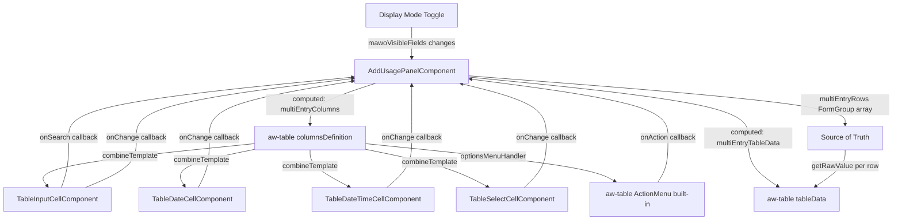

# Design Document: Multi-Entry Table Redesign

## Overview

This design replaces the existing custom HTML `<table>` in the multi-entry section of the Add Usage panel with the CCL `<aw-table>` component. Editable cells use `TableCellTypes.Custom` with `combineTemplate` to render small standalone Angular components inside each cell — text inputs with search buttons, date pickers, select menus, and action menu buttons.

The redesign delivers:
- **All columns** from the Figma design (Equipment, Equipment Description, Transaction Date, Hours Used, all meter fields, all lookup fields, business/individual/total usage, misc fields, and an action column)
- **Dynamic column visibility** driven by the existing `mawoVisibleFields()` computed signal, so columns appear/disappear as the display mode and work order type change
- **Built-in dark/light mode theming and mobile responsiveness** inherited from `aw-table` for free
- **Consistent CCL styling** across all editable cells using `aw-form-field`, `AwInput`, `aw-select-menu`, `aw-date-picker`, `aw-date-time-picker`, and `AwButtonIconOnly`

### Key Design Decisions

1. **`aw-table` with `TableCellTypes.Custom` — not a custom HTML table.** The existing children work orders table already proves this pattern works in the same component. Using `aw-table` gives us sorting infrastructure, theming, and responsive behavior without custom CSS.

2. **Four custom cell components, not one mega-component.** Each cell type has distinct template structure (input+search, date+calendar, select, action menu). Separate components keep each one small and focused:
   - `TableInputCellComponent` — text input with optional search icon button
   - `TableDateCellComponent` — date picker with calendar button
   - `TableDateTimeCellComponent` — date-time picker with calendar button
   - `TableSelectCellComponent` — aw-select-menu dropdown
   The action column uses `aw-table`'s built-in `TableCellTypes.ActionMenu` with `[optionsMenuHandler]` — no custom component needed.

3. **`columnsDefinition` as a `computed()` signal.** The column array must rebuild whenever `mawoVisibleFields()` changes. A computed signal that maps visible field names to their `TableCellInput` definitions handles this reactively.

4. **`tableData` as a computed signal mapping FormGroups to flat objects.** `aw-table` expects `[tableData]` as an array of plain objects. A computed signal reads `multiEntryRows()` (the `FormGroup[]` source of truth) and extracts raw values into flat row objects, adding a `_rowIndex` key for callback targeting.

5. **Callbacks via `componentData` for cell interactions.** Custom cell components receive callbacks (onSearch, onChange, onAction) through `componentData` passed by `combineTemplate`. The parent `AddUsagePanelComponent` handles all dialog opening, value updates, and row manipulation.

6. **Built-in sticky action column via `aw-table`.** The `aw-table` component has `[enableStickyOptions]="true"` (default) which makes the `TableCellTypes.ActionMenu` column sticky with a left shadow. The `[optionsMenuHandler]` input provides dynamic menu items per row (returning `TableActionMenu[]` with "Clear" and "Get Components" actions).

7. **Reuse existing logic.** The same `onMeterKeydown` decimal mask, `createRowFormGroup()` defaults, `extractEntry()` method, and dialog handlers are reused. No business logic duplication.

## Architecture

### Component Interaction



### Data Flow

1. `multiEntryRows` signal holds `FormGroup[]` — this is the source of truth for all row data.
2. `multiEntryTableData` computed signal maps each FormGroup to a flat object via `getRawValue()`, adding `_rowIndex` for callback targeting.
3. `multiEntryColumns` computed signal reads `mawoVisibleFields()` and builds a `TableCellInput[]` array containing only the columns for visible fields, plus Equipment (always) and Action (always).
4. `combineTemplate` functions on each column return the appropriate custom cell component with `componentData` containing the current value, callbacks, and configuration.
5. When a user interacts with a cell (types, selects, clicks search), the callback writes back to the corresponding FormGroup control via `multiEntryRows()[rowIndex].get(fieldName)?.setValue(...)`.
6. The computed `multiEntryTableData` automatically recalculates, and `aw-table` re-renders the affected cells.

### Files Modified

| File | Changes |
|------|---------|
| `add-usage-panel.component.ts` | Add `multiEntryColumns` computed, `multiEntryTableData` computed, cell interaction handlers (onMultiAssetSearch, onMultiTaskSearch, onMultiLookup, onMultiClear, onMultiCellChange), update imports |
| `add-usage-panel.component.html` | Replace custom HTML table with `<aw-table>` + Add Row bar |
| `add-usage-panel.component.scss` | Update multi-entry styles for sticky action column, cell widths, add-row bar |
| `src/app/components/table-input-cell/table-input-cell.component.ts` | New — text input cell with optional search button |
| `src/app/components/table-date-cell/table-date-cell.component.ts` | New — date picker cell with calendar button |
| `src/app/components/table-date-time-cell/table-date-time-cell.component.ts` | New — date-time picker cell with calendar button |
| `src/app/components/table-select-cell/table-select-cell.component.ts` | New — aw-select-menu dropdown cell |

## Components and Interfaces

### Custom Cell Components

All custom cell components follow the same pattern established by `TableTextSubtextComponent` — standalone components with `input()` signals for data, rendered inside `aw-table` cells via `combineTemplate`.

#### TableInputCellComponent

Renders a text input with an optional icon-only search button.

```typescript
@Component({
  selector: 'app-table-input-cell',
  standalone: true,
  imports: [AwFormFieldComponent, AwInputDirective, AwButtonIconOnlyDirective, AwIconComponent],
  template: `
    <div class="table-input-cell">
      <aw-form-field>
        <input AwInput
          [value]="value()"
          [placeholder]="placeholder()"
          [readOnly]="readOnly()"
          [attr.inputmode]="inputMode()"
          [attr.aria-label]="ariaLabel()"
          (input)="onInput($event)"
          (keydown)="onKeydown($event)" />
      </aw-form-field>
      @if (showSearchButton()) {
        <button AwButtonIconOnly [buttonType]="'primary'"
          [ariaLabel]="'Search ' + ariaLabel()"
          type="button"
          (click)="onSearchClick()">
          <aw-icon [iconName]="'search'" [iconColor]="''"></aw-icon>
        </button>
      }
    </div>
  `,
  styles: [`
    .table-input-cell { display: flex; gap: 4px; align-items: flex-start; }
  `]
})
export class TableInputCellComponent {
  value = input<string>('');
  placeholder = input<string>('');
  readOnly = input<boolean>(false);
  inputMode = input<string>('text');
  ariaLabel = input<string>('');
  showSearchButton = input<boolean>(false);
  onChange = input<((value: string) => void) | null>(null);
  onSearch = input<(() => void) | null>(null);
  onKeydownHandler = input<((event: KeyboardEvent) => void) | null>(null);

  onInput(event: Event): void {
    const value = (event.target as HTMLInputElement).value;
    this.onChange()?.call(null, value);
  }

  onKeydown(event: KeyboardEvent): void {
    this.onKeydownHandler()?.call(null, event);
  }

  onSearchClick(): void {
    this.onSearch()?.call(null);
  }
}
```

#### TableDateCellComponent

Renders an `aw-date-picker` with a calendar icon button.

```typescript
@Component({
  selector: 'app-table-date-cell',
  standalone: true,
  imports: [AwFormFieldComponent, AwDatePickerComponent, AwButtonIconOnlyDirective, AwIconComponent, ReactiveFormsModule],
  template: `
    <aw-form-field>
      <aw-date-picker #datePicker
        [formControl]="formControl()"
        [placeholder]="'mm/dd/yyyy'">
      </aw-date-picker>
      <button ariaLabel="calendar" type="button" AwButtonIconOnly
        [buttonType]="'primary'" (click)="datePicker.openCalendar()">
        <aw-icon [iconName]="'today'" [iconColor]="''"></aw-icon>
      </button>
    </aw-form-field>
  `
})
export class TableDateCellComponent {
  formControl = input.required<FormControl>();
}
```

#### TableDateTimeCellComponent

Renders an `aw-date-time-picker` with a calendar icon button.

```typescript
@Component({
  selector: 'app-table-date-time-cell',
  standalone: true,
  imports: [AwFormFieldComponent, AwDateTimePickerComponent, AwButtonIconOnlyDirective, AwIconComponent, ReactiveFormsModule],
  template: `
    <aw-date-time-picker #dateTimePicker
      [formControl]="formControl()"
      [timeFormat]="timeFormat()"
      [ariaLabel]="{date: ariaLabel() + ' Date', time: ariaLabel() + ' Time'}"
      [placeholder]="{date: 'mm/dd/yyyy', time: timePlaceholder()}">
      <button [attr.aria-label]="'open ' + ariaLabel() + ' picker'" type="button"
        AwButtonIconOnly [buttonType]="'primary'" (click)="dateTimePicker.openDateTimePicker()">
        <aw-icon [iconName]="'today'" [iconColor]="''"></aw-icon>
      </button>
    </aw-date-time-picker>
  `
})
export class TableDateTimeCellComponent {
  formControl = input.required<FormControl>();
  timeFormat = input<'12h' | '24h'>('12h');
  ariaLabel = input<string>('');

  timePlaceholder = computed(() =>
    this.timeFormat() === '12h' ? 'hh:mm AM/PM' : 'hh:mm'
  );
}
```

#### TableSelectCellComponent

Renders an `aw-select-menu` dropdown.

```typescript
@Component({
  selector: 'app-table-select-cell',
  standalone: true,
  imports: [AwSelectMenuComponent, ReactiveFormsModule],
  template: `
    <aw-select-menu
      [singleSelectListItems]="options()"
      [enableListReset]="true"
      [placeholder]="placeholder()"
      [formControl]="formControl()"
      [ariaLabel]="ariaLabel()">
    </aw-select-menu>
  `
})
export class TableSelectCellComponent {
  options = input<SingleSelectOption[]>([]);
  placeholder = input<string>('');
  formControl = input.required<FormControl>();
  ariaLabel = input<string>('');
}
```

### Built-in Action Column (aw-table ActionMenu)

The action column uses `aw-table`'s built-in `TableCellTypes.ActionMenu` with `[optionsMenuHandler]` for dynamic per-row menu items and `[enableStickyOptions]="true"` for sticky behavior with left shadow.

```typescript
// Column definition — added as the last column
{ type: TableCellTypes.ActionMenu, key: '_actions', label: ' ' }

// On the aw-table template:
// [optionsMenuHandler]="getMultiEntryRowActions"
// [enableStickyOptions]="true"

/** Returns action menu items for a multi-entry row. */
public getMultiEntryRowActions = (rowData: any): TableActionMenu[] => {
  return [
    { title: 'Clear', action: () => this.onMultiAction(rowData._rowIndex, 'clear') },
    { title: 'Get Components', action: () => this.onMultiAction(rowData._rowIndex, 'getComponents') },
  ];
};
```

### New Signals on `AddUsagePanelComponent`

#### Column Definition Map

A private map from field name to `TableCellInput` definition, used by the computed signal:

```typescript
/** Map of field name → TableCellInput definition for multi-entry columns. */
private buildColumnDef(field: string): TableCellInput | null {
  // Returns the appropriate TableCellInput for each field name
  // Uses combineTemplate to render the correct custom cell component
  // Passes callbacks via componentData for cell interactions
}
```

#### Computed Column Definitions

```typescript
/** Reactive column definitions for the multi-entry aw-table. */
public readonly multiEntryColumns = computed<TableCellInput[]>(() => {
  const visibleFields = this.mawoVisibleFields();
  const columns: TableCellInput[] = [];

  // Equipment column — always visible
  columns.push(this.buildEquipmentColumn());

  // Equipment Description — always visible
  columns.push(this.buildEquipmentDescriptionColumn());

  // Dynamic columns based on visible fields
  for (const field of visibleFields) {
    if (field === 'asset') continue; // Equipment handled above
    const col = this.buildColumnDef(field);
    if (col) columns.push(col);
  }

  // Action column — always last, always visible
  columns.push(this.buildActionColumn());

  return columns;
});
```

#### Computed Table Data

```typescript
/** Flat row objects for aw-table [tableData] binding. */
public readonly multiEntryTableData = computed(() => {
  return this.multiEntryRows().map((row, index) => {
    const raw = row.getRawValue();
    return { ...raw, _rowIndex: index };
  });
});
```

#### Cell Interaction Handlers

```typescript
/** Handle asset search for a multi-entry row. */
public onMultiAssetSearch(rowIndex: number): void {
  this._activeMultiRowIndex = rowIndex;
  this.showAssetSearchDialog.set(true);
}

/** Handle task search for a multi-entry row. */
public onMultiTaskSearch(rowIndex: number): void {
  this._activeMultiRowIndex = rowIndex;
  this.showTaskSearchDialog.set(true);
}

/** Handle lookup placeholder for a multi-entry row. */
public onMultiLookup(rowIndex: number, fieldName: string): void {
  this.onLookupPlaceholder(fieldName);
}

/** Handle cell value change for a multi-entry row. */
public onMultiCellChange(rowIndex: number, fieldName: string, value: any): void {
  this.multiEntryRows()[rowIndex]?.get(fieldName)?.setValue(value);
}

/** Handle action menu selection for a multi-entry row. */
public onMultiAction(rowIndex: number, action: string): void {
  if (action === 'clear') {
    const row = this.multiEntryRows()[rowIndex];
    if (row) {
      const defaults = this.createRowFormGroup();
      Object.keys(defaults.controls).forEach(key => {
        row.get(key)?.setValue(defaults.get(key)?.value);
      });
    }
  }
  // 'getComponents' — placeholder for future implementation
}
```

### Template Changes

**Multi-entry section replacement:**

```html
@if (entryMode() === 'multi') {
  <div class="multi-entry-section">
    <div class="table-responsive d-block">
      <aw-table
        [columnsDefinition]="multiEntryColumns()"
        [tableData]="multiEntryTableData()"
        [optionsMenuHandler]="getMultiEntryRowActions"
        [enableStickyOptions]="true"
        [tableOptions]="{ noDataPlaceholder: 'No usage rows.' }">
      </aw-table>
    </div>
    <div class="add-row-bar">
      <button AwButton [buttonType]="'outlined'" (click)="addRow()">
        <aw-icon [iconName]="'add'"></aw-icon>
        <span>Add Row</span>
      </button>
    </div>
  </div>
}
```

### SCSS Changes

```scss
// ── Multi-entry table (aw-table redesign) ──

.multi-entry-section {
  padding: 16px 0 80px;
}

.add-row-bar {
  padding: 8px 0;
}

// Cell width constraints (via ::ng-deep for aw-table internal cells)
:host ::ng-deep {
  .equipment-cell aw-form-field {
    min-width: 180px;
    max-width: 536px;
  }

  .lookup-cell aw-form-field {
    max-width: 536px;
  }

  .meter-cell aw-form-field {
    width: 180px;
  }
}
```

## Data Models

### Row Data Flow

```
FormGroup[] (multiEntryRows)
    ↓ getRawValue() per row
Plain Object[] (multiEntryTableData)
    ↓ passed to aw-table
aw-table renders cells via combineTemplate
    ↓ user interaction
Callback writes back to FormGroup
    ↓ signal update
multiEntryTableData recomputes
    ↓ aw-table re-renders
```

### Column-to-Field Mapping

| Column Label | Field Key | Cell Type | Component |
|---|---|---|---|
| Equipment | asset | Custom | TableInputCellComponent (search) |
| Equipment Description | assetDescription | Title | — (read-only text) |
| Transaction Date | transactionDate | Custom | TableDateCellComponent |
| Hours Used | hoursUsed | Custom | TableInputCellComponent (decimal) |
| Start Date/Time | startDateTime | Custom | TableDateTimeCellComponent |
| End Date/Time | endDateTime | Custom | TableDateTimeCellComponent |
| Meter 1 Begin | meter1Begin | Custom | TableInputCellComponent (decimal) |
| Meter 1 End | meter1End | Custom | TableInputCellComponent (decimal) |
| Meter 1 Validation | meter1Validation | Custom | TableSelectCellComponent |
| Meter 2 Begin | meter2Begin | Custom | TableInputCellComponent (decimal) |
| Meter 2 End | meter2End | Custom | TableInputCellComponent (decimal) |
| Meter 2 Validation | meter2Validation | Custom | TableSelectCellComponent |
| Business Usage | businessUsage | Custom | TableInputCellComponent (decimal) |
| Individual Usage | individualUsage | Custom | TableInputCellComponent (decimal) |
| Total Usage | totalUsage | Title | — (read-only computed) |
| Account | account | Custom | TableInputCellComponent (search) |
| Operator | operator | Custom | TableInputCellComponent (search) |
| Department | department | Custom | TableInputCellComponent (search) |
| Task | task | Custom | TableInputCellComponent (search) |
| Financial Project Code | financialProjectCode | Custom | TableInputCellComponent (search) |
| Misc 1 | misc1 | Custom | TableInputCellComponent |
| Misc 2 | misc2 | Custom | TableInputCellComponent |
| Misc 3 | misc3 | Custom | TableInputCellComponent |
| Misc 4 | misc4 | Custom | TableInputCellComponent |
| (actions) | _actions | ActionMenu | — (aw-table built-in) |

### FormGroup Field → assetDescription

The existing `createRowFormGroup()` needs a new `assetDescription` FormControl to hold the equipment description text for the read-only column:

```typescript
assetDescription: new FormControl<string | null>(null),
```

## Correctness Properties

*A property is a characteristic or behavior that should hold true across all valid executions of a system — essentially, a formal statement about what the system should do. Properties serve as the bridge between human-readable specifications and machine-verifiable correctness guarantees.*

### Property 1: Column visibility correctness

*For any* display mode (meter, business, both, all), *for any* work order type (standard, mawo), and *for any* combination of misc field toggles (showMisc1–4), the computed `multiEntryColumns` array SHALL contain exactly:
- The Equipment column and Action column (always present), plus
- One column for each field in `mawoVisibleFields()` that has a column definition (excluding 'asset' which maps to Equipment)

No column for a hidden field shall appear, and no visible field shall be missing its column.

**Validates: Requirements 2.1, 2.2, 2.3, 2.4, 2.5, 10.2, 10.3, 14.5**

### Property 2: Lookup field population format

*For any* equipment asset with a non-empty ID and description, selecting that asset SHALL populate the Equipment input with the exact string `"(${equipmentId}) ${equipmentDescription}"`. Similarly, *for any* task with a non-empty ID and description, selecting that task SHALL populate the Task input with `"(${taskId}) ${taskDescription}"`.

**Validates: Requirements 3.4, 6.3**

### Property 3: Total usage computation

*For any* pair of business usage and individual usage numeric values (including null, zero, and decimal values), the Total Usage display value SHALL equal `(business + individual).toFixed(2)`, where null values are treated as 0.

**Validates: Requirements 7.4**

### Property 4: Decimal mask correctness

*For any* input string, the `onMeterKeydown` handler SHALL allow the keystroke only if the resulting value matches the pattern `^\d*\.?\d{0,2}$` (digits with at most one decimal point and at most 2 decimal places). Navigation keys (Backspace, Tab, Arrow keys, Delete, Home, End) are always allowed.

**Validates: Requirements 7.5**

### Property 5: Clear row resets to defaults

*For any* row with arbitrary field values (random strings, numbers, dates, selections), executing the "Clear" action SHALL reset every field in that row's FormGroup to the default value produced by `createRowFormGroup()`.

**Validates: Requirements 11.6**

### Property 6: Add row appends with defaults

*For any* existing number of rows (1 to N), clicking "Add Row" SHALL increase the row count by exactly 1, and the newly added row SHALL have all field values equal to the defaults from `createRowFormGroup()`.

**Validates: Requirements 12.3**

### Property 7: Multi-entry extraction completeness

*For any* set of multi-entry rows with arbitrary field values, clicking "Add" SHALL emit a `UsageEntryResult` with `mode: 'multi'` and an `entries` array whose length equals the number of rows, where each entry contains the corresponding row's field values.

**Validates: Requirements 13.3**

## Error Handling

| Scenario | Handling |
|----------|----------|
| `combineTemplate` receives null/undefined values | Cell components default to empty string via `input<string>('')` |
| User types invalid characters in meter fields | `onMeterKeydown` prevents the keystroke (same as single-entry) |
| Asset search dialog returns no selection | No-op — row values unchanged |
| Task search dialog returns no selection | No-op — row values unchanged |
| `multiEntryRows` is empty | `aw-table` shows "No usage rows." via `noDataPlaceholder` |
| FormGroup control not found during cell change | Null-safe access `?.setValue()` prevents errors |
| Action menu "Get Components" selected | Placeholder — no action taken (future implementation) |

## Testing Strategy

### Unit Tests (Example-Based)

Unit tests verify specific UI behaviors, default states, and component rendering:

| Test | Validates |
|------|-----------|
| Multi-entry mode renders aw-table element | Req 1.1 |
| Column definitions use correct TableCellTypes | Req 1.2, 1.3 |
| Table wrapped in table-responsive d-block div | Req 1.4 |
| Initializes with one empty row | Req 1.5 |
| Equipment column definition has search button | Req 3.1 |
| Equipment column has min-width 180px, max-width 536px | Req 3.2 |
| Search button triggers asset search dialog | Req 3.3 |
| Equipment Description column is TableCellTypes.Title | Req 4.1 |
| Empty description when no asset selected | Req 4.3 |
| Transaction Date column has date picker and calendar button | Req 5.1, 5.2, 5.3 |
| Calendar button opens date picker | Req 5.4 |
| New row defaults transaction date to today | Req 5.5 |
| Task column has search button that opens task dialog | Req 6.1, 6.2 |
| Lookup columns (Operator, Account, etc.) have search buttons | Req 6.4 |
| Lookup search buttons show placeholder alert | Req 6.5 |
| Hours Used column has decimal inputmode and placeholder | Req 7.1 |
| Meter columns have decimal inputmode and mask | Req 7.2 |
| Business/Individual Usage columns have decimal inputmode | Req 7.3 |
| Meter 1 column has 180px width and $00.00 placeholder | Req 7.6 |
| Validation columns render aw-select-menu | Req 8.1, 8.2, 8.3, 8.4 |
| Start/End Date-Time columns render date-time picker | Req 9.1, 9.2, 9.3 |
| Misc columns render text inputs | Req 10.1 |
| Action column is last, has empty label, has more_horiz icon | Req 11.1, 11.2, 11.3 |
| Action column has left box-shadow CSS | Req 11.4 |
| Action menu shows Clear and Get Components | Req 11.5 |
| Add Row bar has 8px padding, outlined button with + icon | Req 12.1, 12.2 |
| Added row is visible in table | Req 12.4 |
| Each row bound to FormGroup | Req 13.1, 13.2 |
| aw-table has columnsDefinition and tableData bindings | Req 14.1, 14.2, 14.3 |

### Property-Based Tests

Property-based tests verify universal correctness across randomized inputs. Each test runs a minimum of 100 iterations using Jasmine loops with random data generation.

| Property Test | Tag | Validates |
|---|---|---|
| Column visibility correctness | Feature: multi-entry-table-redesign, Property 1 | Req 2.1–2.5, 10.2, 10.3, 14.5 |
| Lookup field population format | Feature: multi-entry-table-redesign, Property 2 | Req 3.4, 6.3 |
| Total usage computation | Feature: multi-entry-table-redesign, Property 3 | Req 7.4 |
| Decimal mask correctness | Feature: multi-entry-table-redesign, Property 4 | Req 7.5 |
| Clear row resets to defaults | Feature: multi-entry-table-redesign, Property 5 | Req 11.6 |
| Add row appends with defaults | Feature: multi-entry-table-redesign, Property 6 | Req 12.3 |
| Multi-entry extraction completeness | Feature: multi-entry-table-redesign, Property 7 | Req 13.3 |

**Property test configuration:**
- Library: Jasmine loops (100 iterations per property, random data generation)
- Each test references its design document property via tag comment
- Tag format: `Feature: multi-entry-table-redesign, Property {number}: {property_text}`
